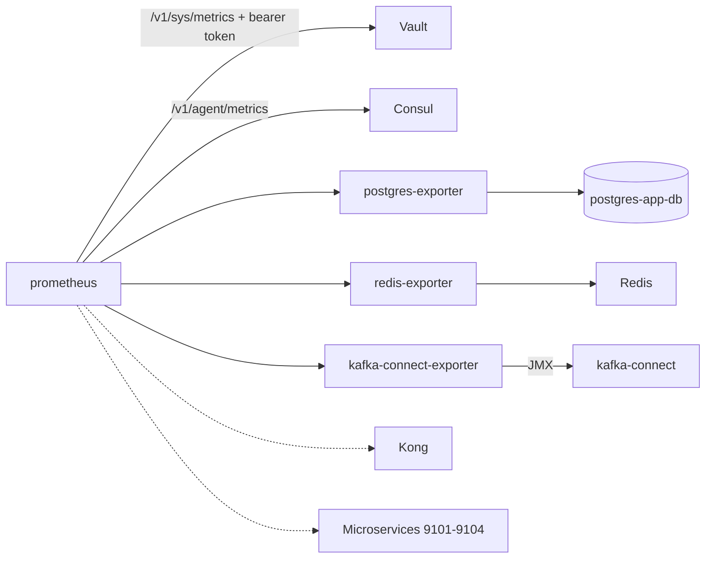

# Prometheus — Architecture

> Central Prometheus TSDB (30-day retention) scraping Vault, Consul, Postgres, Redis and Kafka Connect (Debezium CDC), with bundled exporters. UI on `127.0.0.1:9090` (loopback only).

## Overview

The Prometheus stack is a Docker Compose deployment inside `aws/prometheus/`, started locally with `make up` / `make all` (wiring into the root `aws/` orchestrator is pending). Prometheus pulls metrics from the stack's own components and a set of bundled exporters; the time series feed the Grafana dashboards.

## Components

| Container              | Image                                           | Host port      | Network                      | Purpose                                                                      |
| ---------------------- | ----------------------------------------------- | -------------- | ---------------------------- | ---------------------------------------------------------------------------- |
| prometheus             | `prom/prometheus:v2.53.0`                       | 127.0.0.1:9090 | host network (loopback)      | TSDB, UI and API                                                             |
| postgres-exporter      | `prometheuscommunity/postgres-exporter:v0.15.0` | 127.0.0.1:9187 | kafka-network                | Postgres metrics via `postgres-app-db:5432`                                  |
| redis-exporter         | `oliver006/redis_exporter:v1.62.0`              | 127.0.0.1:9121 | kafka-network + host-gateway | Redis metrics via `host.docker.internal:6379`                                |
| kafka-connect-exporter | `bitnamilegacy/jmx-exporter:0.20.0`             | 127.0.0.1:9309 | kafka-network                | JMX metrics of Kafka Connect (Debezium CDC)                                  |
| kafka-exporter         | `bitnamilegacy/jmx-exporter:0.20.0`             | 127.0.0.1:9308 | kafka-network                | Broker JMX — not deployed (best-effort, see [data-sources](data-sources.md)) |

`bitnami/jmx-exporter:0.20.0` no longer exists on Docker Hub (the `bitnami/` repo is now paid-only); the free `bitnamilegacy/jmx-exporter:0.20.0` image is used instead, running `java -jar jmx_prometheus_httpserver.jar <port> <config>`.

## Data flow

Solid edges are active scrapes. Dotted edges are scrape jobs that stay commented until a real target exists.

## Networking

- **Prometheus runs on the host network** (`network_mode: host`) and binds its UI/API to loopback only (`--web.listen-address=127.0.0.1:9090`). This is required because the host firewall (UFW, default deny) drops TCP from Docker bridges to host-network services — Consul (`network_mode: host`, port 8500) would otherwise be unreachable. Prometheus scrapes every target through `127.0.0.1:<published port>`.
- The **exporters** join the shared external Docker network **`kafka-network`**: postgres-exporter resolves `postgres-app-db:5432` by name and kafka-connect-exporter resolves `kafka-connect:8778` by name.
- **Redis** is not on `kafka-network`; redis-exporter reaches it through the host gateway (`extra_hosts: host.docker.internal:host-gateway`, `REDIS_ADDR=host.docker.internal:6379`).
- All published ports bind to **loopback only** (`127.0.0.1`); nothing is exposed on the LAN.

## Storage and retention

- Time series live in the named volume **`prometheus_data`** at `/prometheus` (TSDB path flag).
- Retention is **30 days** (`--storage.tsdb.retention.time=30d`).
- `--web.enable-lifecycle` allows config reloads through `POST /-/reload`.

## Configuration and secrets

- `prometheus.yml` is mounted read-only at `/etc/prometheus/prometheus.yml`.
- Global scrape config: `scrape_interval: 15s`, `evaluation_interval: 15s`, `external_labels: project=sca, environment=dev`.
- The `.env` file is generated by `scripts/gen-env.sh` from Vault `secret/api-template/dev` and carries `DATA_SOURCE_NAME` (Postgres DSN rewritten to `postgres-app-db:5432`), `REDIS_ADDR` and `REDIS_PASSWORD`. It is gitignored, `chmod 600`.
- The Vault token is mounted read-only from `../vault/data/secrets/root-token.txt` into `/etc/prometheus/vault-token`, used as bearer token for the Vault scrape. After a Vault re-init (`make clean`) the token changes: re-run `make up` to remount it.

## Service registration

Consul is expected to register the stack services with TCP checks on `127.0.0.1:<port>` — `prometheus:9090`, `postgres-exporter:9187`, `redis-exporter:9121`, `kafka-connect-exporter:9309`. The registration (in `../consul/scripts/register-services.sh`) is pending the `consul/` pass.

## Production reference

The same exporter ports and scrape endpoints run in production via `ansible/roles/observability/`. The local stack mirrors `prom/prometheus:v2.53.0`, 30-day retention, `--web.enable-lifecycle` and the `:9187` / `:9121` / `:9308` exporter ports where applicable. Note: the Ansible reference still pins `bitnami/jmx-exporter:0.20.0`, which no longer exists — production should adopt `bitnamilegacy/jmx-exporter:0.20.0` too.

## Related

- [data-sources.md](data-sources.md) — scrape jobs and metric namespaces.
- [README.md](../README.md) — commands, stack lifecycle and troubleshooting.
- Vault note: [04-infrastructure/prometheus.md (sca-docs)](https://github.com/sca-node-template/sca-docs/blob/main/04-infrastructure/prometheus.md).
