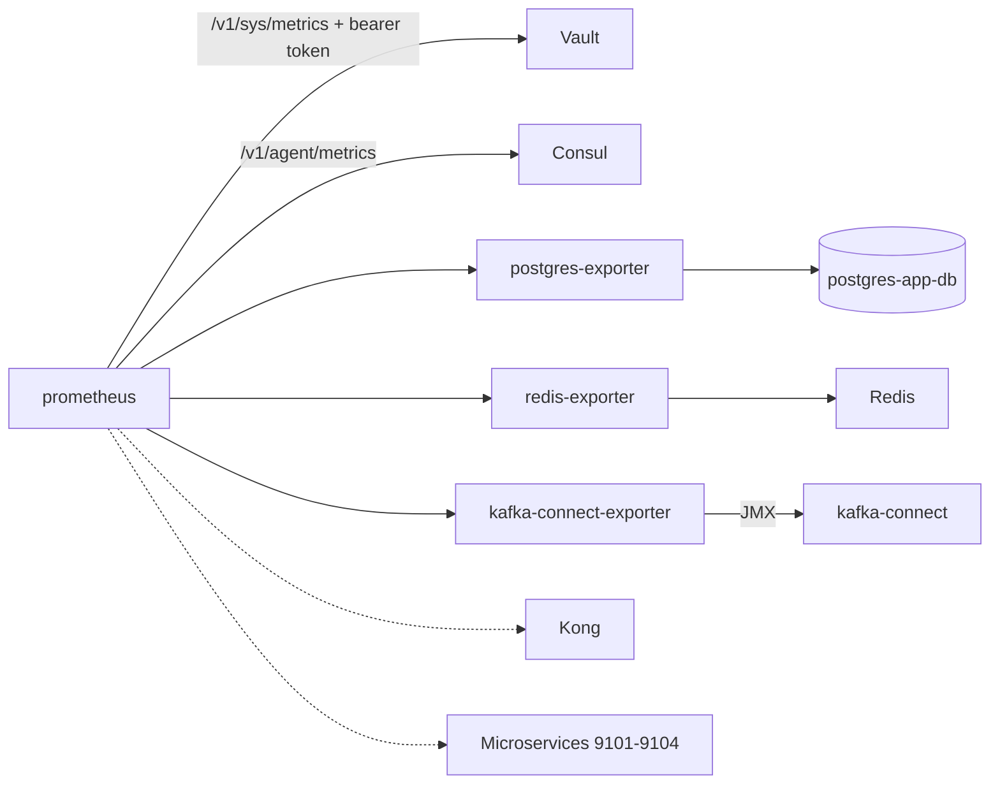

# Prometheus — Architecture

> Central Prometheus TSDB (30-day retention) scraping Vault, Consul, Postgres, Redis and Kafka Connect (Debezium CDC), with bundled exporters. UI on `127.0.0.1:9090` (loopback only).

## Overview

The Prometheus stack is a Docker Compose deployment inside `aws/prometheus/`, lifted by the root orchestrator (`make all`). Prometheus pulls metrics from the stack's own components and a set of bundled exporters; the time series feed the Grafana dashboards.

## Components

| Container | Image | Host port | Network | Purpose |
|---|---|---|---|---|
| prometheus | `prom/prometheus:v2.53.0` | 127.0.0.1:9090 | kafka-network + host-gateway | TSDB, UI and API |
| postgres-exporter | `prometheuscommunity/postgres-exporter:v0.15.0` | 127.0.0.1:9187 | kafka-network | Postgres metrics via `postgres-app-db:5432` |
| redis-exporter | `oliver006/redis_exporter:v1.62.0` | 127.0.0.1:9121 | kafka-network + host-gateway | Redis metrics via `host.docker.internal:6379` |
| kafka-connect-exporter | `bitnami/jmx-exporter:0.20.0` | 127.0.0.1:9309 | kafka-network | JMX metrics of Kafka Connect (Debezium CDC) |
| kafka-exporter | `bitnami/jmx-exporter:0.20.0` | 127.0.0.1:9308 | kafka-network | Broker JMX — not deployed (best-effort, see [data-sources](data-sources.md)) |

Image versions match the production reference in `ansible/roles/observability/`.

## Data flow

Solid edges are active scrapes. Dotted edges are scrape jobs that stay commented until a real target exists.

## Networking

- The stack joins the shared external Docker network **`kafka-network`**; containers resolve each other by name (`postgres-exporter`, `kafka-connect-exporter`, `kong`).
- **Redis and Vault are not on `kafka-network`**, so they are reached through the host: `extra_hosts: host.docker.internal:host-gateway` maps the Docker host into the containers, and the scrapes target `host.docker.internal:<port>`.
- All published ports bind to **loopback only** (`127.0.0.1`); nothing is exposed on the LAN.

## Storage and retention

- Time series live in the named volume **`prometheus_data`** at `/prometheus` (TSDB path flag).
- Retention is **30 days** (`--storage.tsdb.retention.time=30d`).
- `--web.enable-lifecycle` allows config reloads through `POST /-/reload`.

## Configuration and secrets

- `prometheus.yml` is mounted read-only at `/etc/prometheus/prometheus.yml`.
- Global scrape config: `scrape_interval: 15s`, `evaluation_interval: 15s`, `external_labels: project=sca, environment=dev`.
- The `.env` file is generated by `scripts/gen-env.sh` from Vault `secret/api-template/dev` and carries `DATA_SOURCE_NAME` (Postgres DSN rewritten to `postgres-app-db:5432`), `REDIS_ADDR` and `REDIS_PASSWORD`. It is gitignored, `chmod 600`.
- The Vault token is mounted read-only from `../vault/data/secrets/root-token.txt` into `/etc/prometheus/vault-token`, used as bearer token for the Vault scrape. After a Vault re-init (`make clean`) the token changes: re-run `make up` to remount it.

## Service registration

Consul registers the stack services with TCP checks on `127.0.0.1:<port>`: `prometheus:9090`, `postgres-exporter:9187`, `redis-exporter:9121`, `kafka-connect-exporter:9309`.

## Production reference

The same images, exporter ports and scrape endpoints run in production via `ansible/roles/observability/`. The local stack mirrors `prom/prometheus:v2.53.0`, 30-day retention, `--web.enable-lifecycle` and the `:9187` / `:9121` / `:9308` exporter ports where applicable.

## Related

- [data-sources.md](data-sources.md) — scrape jobs and metric namespaces.
- [README.md](../README.md) — commands, stack lifecycle and troubleshooting.
- Vault note: [04-infrastructure/prometheus.md (sca-docs)](https://github.com/sca-node-template/sca-docs/blob/main/04-infrastructure/INDEX.md).
